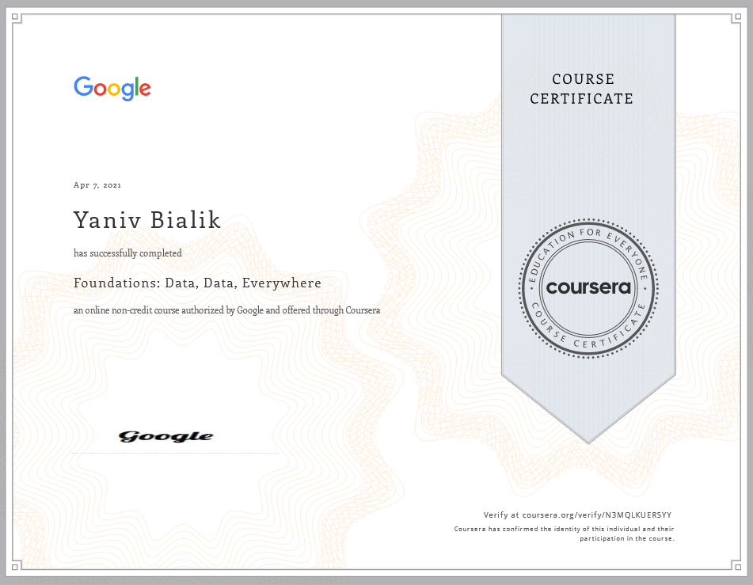

## [C​ourse 1 – Foundations: Data, Data, Everywhere](https://www.coursera.org/learn/foundations-data?specialization=google-data-analytics)

This is the first course in the Google Data Analytics Certificate. These courses will equip you with the skills you need to apply to introductory-level data analyst jobs. Organizations of all kinds need data analysts to help them improve their processes, identify opportunities and trends, launch new products, and make thoughtful decisions. In this course, you’ll be introduced to the world of data analytics through hands-on curriculum developed by Google. The material shared covers plenty of key data analytics topics, and it’s designed to give you an overview of what’s to come in the Google Data Analytics Certificate. Current Google data analysts will instruct and provide you with hands-on ways to accomplish common data analyst tasks with the best tools and resources.

&nbsp;

### C​ourse content

1. **I​ntroducing data analytics**: Data helps us make decisions, in everyday life and in business. In this first part of the course, you will learn how data analysts use tools of their trade to inform those decisions. You will also get to know more about this course and the overall program expectations.
2. **T​hinking analytically**: Data analysts balance many different roles in their work. In this part of the course, you will learn about some of these roles and the key skills that are required. You will also explore analytical thinking and how it relates to data-driven decision making.
3. **E​xploring the wonderful world of data**: Data has its own life cycle, and data analysts use an analysis process that cuts across and leverages this life cycle. In this part of the course, you will learn about the data life cycle and data analysis process. They are both relevant to your work in this program and on the job as a future data analyst. You will be introduced to applications that help guide data through the data analysis process.
4. **S​etting up a data toolbox**: Spreadsheets, query languages, and data visualization tools are all a big part of a data analyst’s job. In this part of the course, you will learn the basic concepts to use them for data analysis. You will understand how they work through examples provided.
5. **D​iscovering data career possibilities**: All kinds of businesses value the work that data analysts do. In this part of the course, you will examine different types of businesses and the jobs and tasks that analysts do for them. You will also learn how a Google Data Analytics Certificate will help you meet many of the requirements for a position with these organizations.
6. **C​ompleting the Course Challenge**: At the end of this course, you will be able to put everything you have learned into perspective with the Course Challenge. The Course Challenge will ask you questions about the main concepts you have learned and then give you an opportunity to apply those concepts in two scenarios.
