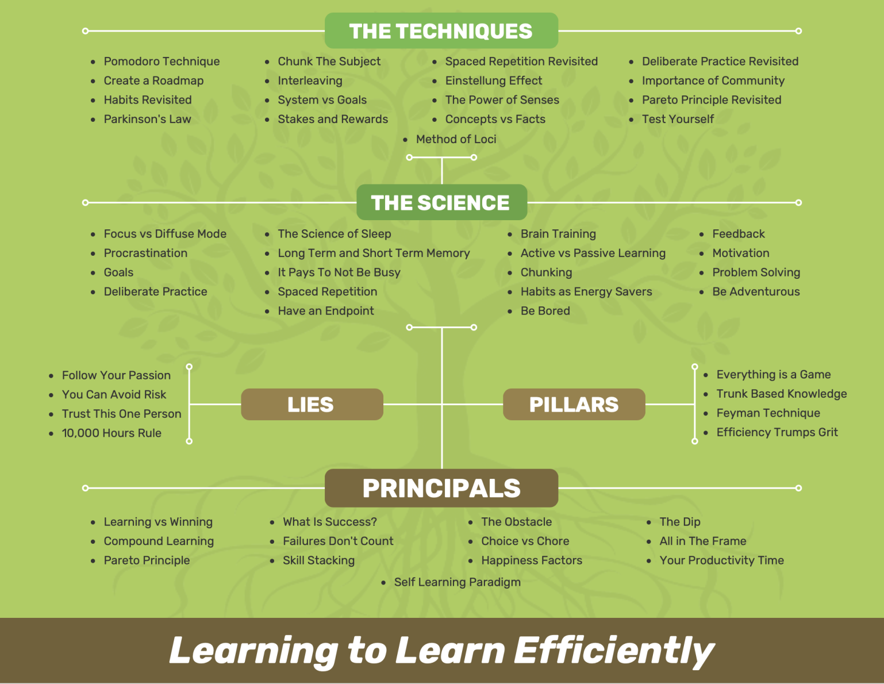

The Techniques
1. Pomodoro Technique

The Pomodoro Technique is a method for time-blocking and chunking. Work for a certain time (25 minutes or more), then take a break. Rinse and repeat.
It also helps against procrastination, as you define the time block before starting.

According to Wikipedia, there are six steps:

        Decide on the task to be done.
        Set the pomodoro timer (traditionally to 25 minutes).
        Work on the task.
        End work when the timer rings and put a checkmark on a piece of paper.
        If you have fewer than four checkmarks, take a short break (3–5 minutes), then go to step 2.
        After four pomodoros, take a longer break (15–30 minutes), reset your checkmark count to zero, then go to step 1.

Andrei, the instructor for the course, recommends starting with your most challenging task first.
2. Chunk The Subject

Combine subjects and concepts to give it meaning.

A popular method for cracking particular algorithm challenges is the Divide and Conquer method.

You break down the problem into small parts and use them to learn or solve problems.

Examples for chunk-based learning curriculums are Khan Academy or Duolingo.

Exercise: Write a 1-page summary of everything you need to learn.
If it’s too tricky, you have to chunk more. Example.
3. Spaced Repetition (Revisited)

Avoid over-learning. There is a forgetting curve.

The effort of recalling and retrieving information enables reconciliation in your brain. Reconciliation leads to strengthening the required neural pathways.

(That’s why the Feynman Technique works so well.)

A popular flash-card tool is Anki.

Another method is to use diagrams or mind-maps to distill the main concepts.
4. Deliberate Practice (Revisited)

Avoid the easy tasks. Take on challenging projects.

Every day, carve out focus time (you can use the Pomodoro technique, for example).

Then, push yourself to the edge of your ability: “Have I done this before? What’s the +1?”

Aim for immediate feedback.

Measure it. Write it down.
5. Create a Roadmap

You need a plan. Prepare. Create a curriculum. Research.

What do industry leaders say? What are the topics I need to learn? Where are the quality resources?

What are the most important topics? What are my measures of success? How does that benefit me or someone else?
6. Interleaving

Vary learning methods, vary practicing different skills: “mix it up.”
7. Einstellung

German Einstellung Effect: a rigid mindset that hinders you from broadening your horizons.

Be willing to be wrong.

“What is option C?” You thought of options A and B, but might there be another way?
7. Importance of Community

A community can help you to identify blind spots, can assist you and provide feedback. Others can hold you accountable.
8. Habits (Revisited)

Habits are automatic and thus save energy.

The habit loop: cue (trigger), a routine, then reward. You also believe in the habit (that it’s right for you, or that the reward is tied to the routine (“smoking relaxes me”). (See The Power of Habit by Charles Duhigg).

Instead of using willpower (depletable resource), it’s better to use habits.

Four of behavior change (from “Atomic Habits”):

    obvious
    easy
    attractive
    satisfying

Don’t break the chain - a method for building consistency.
9. System vs. Goals

Create systems instead of goals:

    For example, losing ten pounds is a goal (that most people can’t maintain), whereas learning to eat right is a system that substitutes knowledge for willpower.

10. The Power of the Senses

Stories and metaphors are essential. You have to try to make sense of the material.

Example: You can learn in stimulating environments to make it memorable.
11. Method of Loci

The technique helps with invoking many senses.
12. The Pareto Principle (Revisited)

Use the 80/20 rule to identify the critical skills you need to acquire.

Ask yourself: “Is this the best use of my time?“ - “Is this the most critical piece of information?”

Try to remove the unnecessary.
13. Parkinson’s Law

From Wikipedia:

    Parkinson’s law is the adage that “work expands so as to fill the time available for its completion”. It is sometimes applied to the growth of bureaucracy in an organization.

Use the law to your advantage. For example, use the Pomodoro technique to constrain yourself. Set deadlines to force yourself to limit your project to a particular time-frame.
14. Deep Work

Deep work is focussed, highly engaged work/practice.

Here’s a book summary of “Deep Work”:

    Deep work is the ability to focus without distraction on a cognitively demanding task.
    Shallow work is non-cognitively demanding, logistical-style work, often performed while distracted.

15. Stakes and Rewards

Aim for small wins to stay motivated.

“What’s at stake?” - what happens when you don’t achieve your goal? What are the consequences? You have to have skin in the game.

Hold yourself accountable.
16. Concepts vs. Facts

Facts are easy to search for (Wikipedia, Google).

How are things connected? Concepts are high-level topics that you can use to come up with unique solutions.

Concepts are the “trunks” of your knowledge tree. After you’ve incorporated them, it’s easier to learn the “leaves” of a topic. Focus on the foundations first.

Ask: why?
17. Test Yourself

What are the key ideas? How can I summarize this?

What did you just learn? Quiz yourself. Use recall to gain feedback on your understanding.
